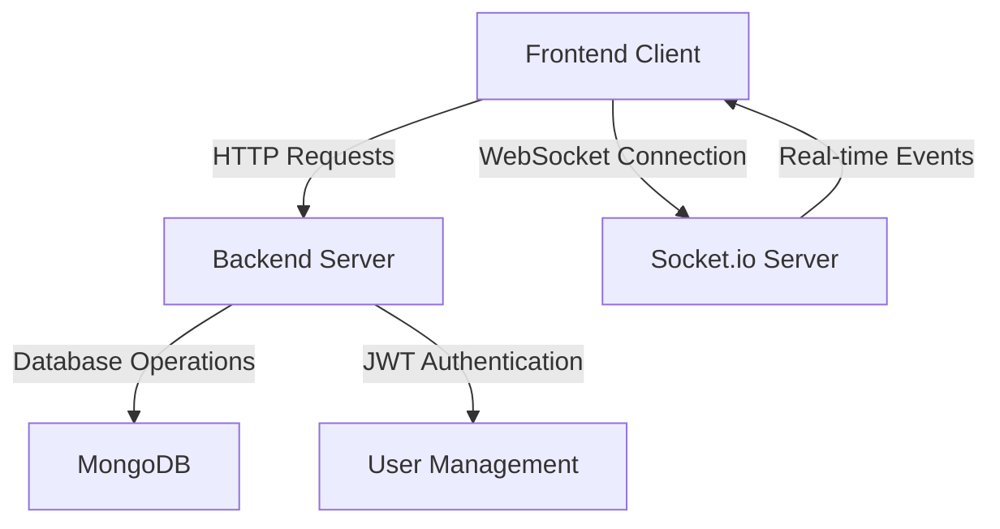
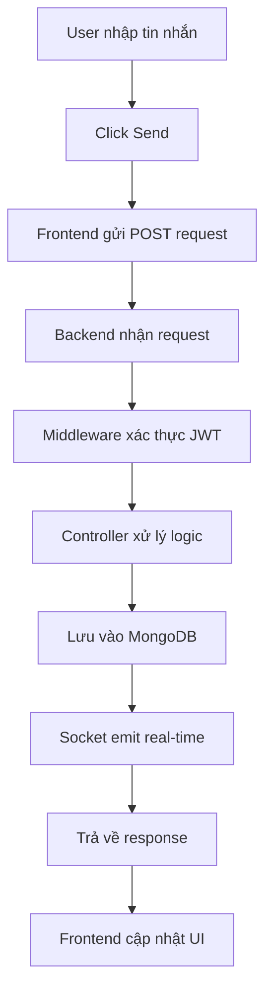
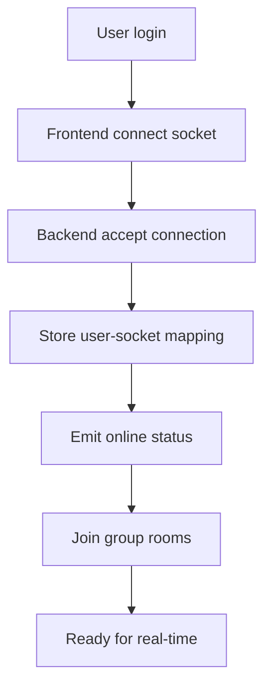
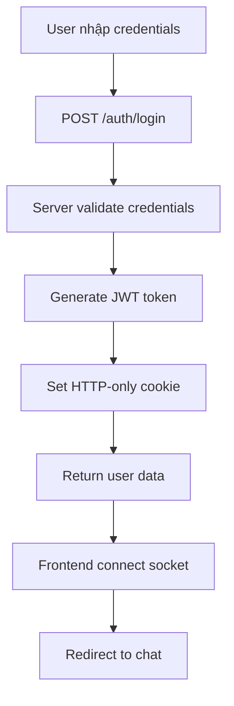
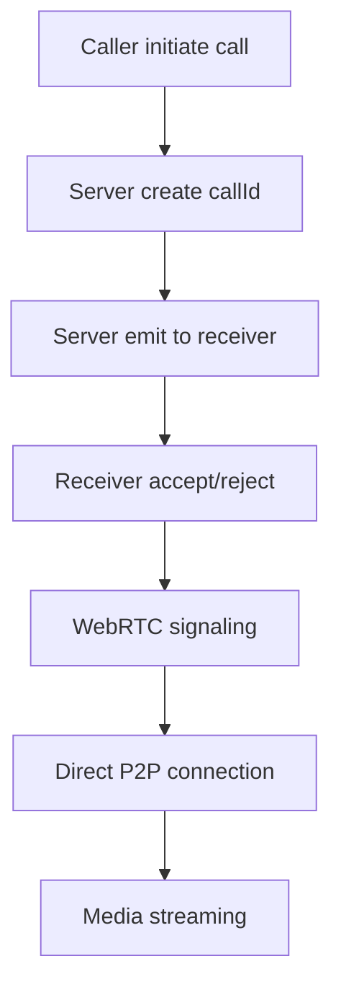

# 🌐 CLIENT-SERVER COMMUNICATION FLOW - CHAT TING TING

## 📋 **Mục Lục**
1. [Tổng Quan Communication Flow](#tổng-quan-communication-flow)
2. [HTTP Request Flow](#http-request-flow)
3. [WebSocket Real-time Flow](#websocket-real-time-flow)
4. [Authentication Flow](#authentication-flow)
5. [Video Call Flow](#video-call-flow)
6. [Error Handling](#error-handling)
7. [Best Practices](#best-practices)

---

## 🎯 **TỔNG QUAN COMMUNICATION FLOW**

### **Kiến Trúc Giao Tiếp**


**Các loại giao tiếp:**
- ✅ **HTTP RESTful APIs**: CRUD operations, authentication
- ✅ **WebSocket Real-time**: Instant messaging, notifications
- ✅ **WebRTC P2P**: Video/voice calls
- ✅ **File Upload**: Image sharing via Cloudinary

---

## 📤 **HTTP REQUEST FLOW**

### **1. Luồng Gửi Tin Nhắn**



#### **Frontend (Client) - Gửi tin nhắn:**
```javascript
// frontend/src/components/MessageInput.jsx
const handleSendMessage = async () => {
  try {
    // 1. Gửi HTTP POST request
    const response = await axiosInstance.post(`/messages/send/${selectedUser._id}`, {
      text: messageText,
      timestamp: new Date()
    });
    
    // 2. Cập nhật UI ngay lập tức (optimistic update)
    setMessages(prev => [...prev, response.data]);
    
    // 3. Clear input
    setMessageText("");
    
  } catch (error) {
    toast.error("Không thể gửi tin nhắn");
  }
};
```

#### **Backend (Server) - Xử lý tin nhắn:**
```javascript
// backend/src/controllers/message.controller.js
export const sendMessage = async (req, res) => {
  try {
    const { text, image } = req.body;        // 👈 Dữ liệu từ client
    const senderId = req.user._id;           // 👈 Từ JWT token
    const receiverId = req.params.id;        // 👈 Từ URL params
    
    // 1. Tạo tin nhắn mới trong database
    const newMessage = await Message.create({
      senderId,
      receiverId,
      text,
      image,
      isRead: false
    });
    
    // 2. Populate thông tin người gửi
    await newMessage.populate("senderId", "fullName profilePic");
    
    // 3. Emit real-time qua Socket.io
    const receiverSocketId = getReceiverSocketId(receiverId);
    if (receiverSocketId) {
      io.to(receiverSocketId).emit("newMessage", newMessage);
      
      // 4. Cập nhật unread counts
      const unreadCounts = await Message.aggregate([
        { $match: { receiverId, isRead: false, groupId: { $exists: false } } },
        { $group: { _id: "$senderId", count: { $sum: 1 } } }
      ]);
      
      const unreadMap = {};
      unreadCounts.forEach(item => { 
        unreadMap[item._id.toString()] = item.count; 
      });
      
      io.to(receiverSocketId).emit("unreadCountsUpdate", unreadMap);
    }
    
    // 5. Trả về response cho sender
    res.status(201).json(newMessage);
    
  } catch (error) {
    res.status(500).json({ error: "Internal server error" });
  }
};
```

### **2. Các Loại HTTP Request**

#### **GET Request (Lấy dữ liệu)**
```javascript
// Frontend
const getMessages = async (userId) => {
  const response = await axiosInstance.get(`/messages/${userId}`);
  return response.data;
};

// Backend
export const getMessages = async (req, res) => {
  const { id } = req.params;
  const myId = req.user._id;
  
  const messages = await Message.find({
    $or: [
      { senderId: myId, receiverId: id },
      { senderId: id, receiverId: myId }
    ]
  }).populate("senderId", "fullName profilePic");
  
  res.json(messages);
};
```

#### **POST Request (Tạo mới)**
```javascript
// Frontend
const createGroup = async (groupData) => {
  const response = await axiosInstance.post('/groups/create', groupData);
  return response.data;
};

// Backend
export const createGroup = async (req, res) => {
  const { name, members } = req.body;
  
  const group = await Group.create({
    name,
    createdBy: req.user._id,
    members: [...members, req.user._id]
  });
  
  res.status(201).json(group);
};
```

#### **PUT Request (Cập nhật)**
```javascript
// Frontend
const updateProfile = async (data) => {
  const response = await axiosInstance.put('/auth/update-profile', data);
  return response.data;
};

// Backend
export const updateProfile = async (req, res) => {
  const { fullName, email } = req.body;
  
  const updatedUser = await User.findByIdAndUpdate(
    req.user._id,
    { fullName, email },
    { new: true }
  );
  
  res.json(updatedUser);
};
```

#### **DELETE Request (Xóa)**
```javascript
// Frontend
const deleteMessage = async (messageId) => {
  await axiosInstance.delete(`/messages/${messageId}`);
};

// Backend
export const deleteMessage = async (req, res) => {
  const { messageId } = req.params;
  
  const message = await Message.findById(messageId);
  if (message.senderId.toString() !== req.user._id.toString()) {
    return res.status(403).json({ error: "Unauthorized" });
  }
  
  await Message.findByIdAndDelete(messageId);
  
  // Emit real-time deletion
  if (message.groupId) {
    io.to(`group:${message.groupId}`).emit("messageDeleted", { messageId });
  } else {
    const receiverSocketId = getReceiverSocketId(message.receiverId);
    if (receiverSocketId) {
      io.to(receiverSocketId).emit("messageDeleted", { messageId });
    }
  }
  
  res.json({ message: "Message deleted" });
};
```

---

## ⚡ **WEBSOCKET REAL-TIME FLOW**

### **1. Socket Connection Flow**



#### **Frontend (Client) - Socket connection:**
```javascript
// frontend/src/store/useAuthStore.js
const connectSocket = () => {
  const newSocket = io(BASE_URL, {
    withCredentials: true,
    query: { userId: authUser._id.toString() }
  });
  
  // Lắng nghe tin nhắn mới
  newSocket.on("newMessage", (message) => {
    console.log("📨 Nhận tin nhắn mới:", message);
    useChatStore.getState().addMessage(message);
  });
  
  // Lắng nghe cập nhật unread counts
  newSocket.on("unreadCountsUpdate", (unreadCounts) => {
    useChatStore.getState().setUnreadCounts(unreadCounts);
  });
  
  // Lắng nghe online status
  newSocket.on("userOnline", (userId) => {
    const { onlineUsers } = get();
    if (!onlineUsers.includes(userId)) {
      set({ onlineUsers: [...onlineUsers, userId] });
    }
  });
  
  set({ socket: newSocket });
};
```

#### **Backend (Server) - Socket handling:**
```javascript
// backend/src/lib/socket.js
io.on('connection', (socket) => {
  const userId = socket.handshake.query.userId;
  userSocketMap[userId] = socket.id;
  
  // Thông báo user online
  socket.broadcast.emit("userOnline", userId);
  
  // Join group rooms
  socket.on("joinGroups", (groupIds = []) => {
    groupIds.forEach((gid) => socket.join(`group:${gid}`));
  });
  
  // Lắng nghe tin nhắn từ client
  socket.on('sendMessage', async (messageData) => {
    try {
      // 1. Lưu tin nhắn vào database
      const message = await Message.create(messageData);
      
      // 2. Broadcast đến tất cả users trong group
      if (messageData.groupId) {
        io.to(`group:${messageData.groupId}`).emit('newMessage', {
          ...message.toObject(),
          sender: await User.findById(messageData.senderId)
        });
      } else {
        // 3. Gửi đến receiver cụ thể
        const receiverSocketId = getReceiverSocketId(messageData.receiverId);
        if (receiverSocketId) {
          io.to(receiverSocketId).emit('newMessage', message);
        }
      }
    } catch (error) {
      socket.emit('error', 'Failed to send message');
    }
  });
  
  // Handle disconnection
  socket.on('disconnect', () => {
    if (userId) {
      delete userSocketMap[userId];
      socket.broadcast.emit("userOffline", userId);
    }
  });
});
```

### **2. Real-time Message Broadcasting**

```javascript
// Backend: Broadcast message to group
socket.on('sendMessage', async (messageData) => {
  try {
    // Save to database
    const message = await Message.create(messageData);
    
    // Broadcast to all users in group
    io.to(`group:${messageData.groupId}`).emit('newMessage', {
      ...message.toObject(),
      sender: await User.findById(messageData.senderId)
    });
  } catch (error) {
    socket.emit('error', 'Failed to send message');
  }
});
```

---

## 🔐 **AUTHENTICATION FLOW**

### **1. Login Flow**



#### **Frontend (Login):**
```javascript
// frontend/src/store/useAuthStore.js
login: async (data) => {
  set({ isLoggingIn: true });
  
  try {
    // 1. Gửi HTTP POST request
    const res = await axiosInstance.post("/auth/login", data);
    
    // 2. Lưu user data vào state
    set({ authUser: res.data });
    
    // 3. Kết nối socket
    get().connectSocket();
    
    return true;
  } catch (error) {
    toast.error("Login failed");
    return false;
  } finally {
    set({ isLoggingIn: false });
  }
}
```

#### **Backend (Login):**
```javascript
// backend/src/controllers/auth.controller.js
export const login = async (req, res) => {
  try {
    const { email, password } = req.body;
    
    // 1. Tìm user trong database
    const user = await User.findOne({ email }).select("+password");
    if (!user) {
      return res.status(400).json({ error: "Invalid credentials" });
    }
    
    // 2. Verify password
    const isPasswordCorrect = await bcrypt.compare(password, user.password);
    if (!isPasswordCorrect) {
      return res.status(400).json({ error: "Invalid credentials" });
    }
    
    // 3. Generate JWT token
    const token = jwt.sign(
      { userId: user._id },
      process.env.JWT_SECRET,
      { expiresIn: "7d" }
    );
    
    // 4. Set HTTP-only cookie
    res.cookie("jwt", token, {
      httpOnly: true,
      maxAge: 7 * 24 * 60 * 60 * 1000,
      sameSite: "strict"
    });
    
    // 5. Trả về user data
    user.password = undefined;
    res.status(200).json(user);
    
  } catch (error) {
    res.status(500).json({ error: "Internal server error" });
  }
};
```

### **2. Middleware Authentication**

```javascript
// backend/src/middleware/auth.middleware.js
export const protectRoute = async (req, res, next) => {
  try {
    // 1. Lấy token từ cookie
    const token = req.cookies.jwt;
    
    if (!token) {
      return res.status(401).json({ error: "No token provided" });
    }
    
    // 2. Verify JWT token
    const decoded = jwt.verify(token, process.env.JWT_SECRET);
    
    // 3. Tìm user trong database
    const user = await User.findById(decoded.userId).select("-password");
    if (!user) {
      return res.status(401).json({ error: "Invalid token" });
    }
    
    // 4. Gán user vào request object
    req.user = user;
    next();
    
  } catch (error) {
    res.status(401).json({ error: "Invalid token" });
  }
};
```

---

## 🎥 **VIDEO CALL FLOW**

### **1. Video Call Signaling**



#### **Frontend (Caller) - Khởi tạo cuộc gọi:**
```javascript
// frontend/src/store/useVideoCallStore.js
const initiateCall = async (receiverId, callType) => {
  try {
    // 1. Gửi yêu cầu gọi qua Socket
    socket.emit("initiateCall", { receiverId, callType });
    
    // 2. Lắng nghe phản hồi
    socket.on("callAccepted", async (data) => {
      await initializePeerConnection();
      await createOffer();
    });
    
    socket.on("callRejected", () => {
      set({ callStatus: "rejected" });
    });
    
  } catch (error) {
    console.error("Failed to initiate call:", error);
  }
};
```

#### **Backend (Server) - Call signaling:**
```javascript
// backend/src/lib/socket.js
socket.on("initiateCall", async (data) => {
  const { receiverId, callType } = data;
  const callerId = socket.handshake.query.userId;
  
  // 1. Tạo callId duy nhất
  const callId = generateCallId();
  
  // 2. Lưu thông tin cuộc gọi
  activeCalls.set(callId, {
    callerId,
    receiverId,
    callType,
    status: "ringing"
  });
  
  // 3. Gửi thông báo đến receiver
  const receiverSocketId = getReceiverSocketId(receiverId);
  if (receiverSocketId) {
    io.to(receiverSocketId).emit("incomingCall", {
      callId,
      callerId,
      callType,
      callerName: await getUserName(callerId)
    });
  }
  
  // 4. Gửi callId về cho caller
  socket.emit("callInitiated", { callId });
});
```

### **2. WebRTC Signaling**

```javascript
// Frontend: Create offer
const createOffer = async () => {
  try {
    // 1. Tạo offer
    const offer = await peerConnection.createOffer();
    await peerConnection.setLocalDescription(offer);
    
    // 2. Gửi offer qua Socket
    socket.emit("offer", {
      callId: currentCall.callId,
      offer: offer
    });
  } catch (error) {
    console.error("Failed to create offer:", error);
  }
};

// Backend: Handle offer
socket.on("offer", (data) => {
  const { callId, offer } = data;
  const call = activeCalls.get(callId);
  
  if (call) {
    const receiverSocketId = getReceiverSocketId(call.receiverId);
    if (receiverSocketId) {
      io.to(receiverSocketId).emit("offer", { callId, offer });
    }
  }
});
```

---

## 🛡️ **ERROR HANDLING**

### **1. Frontend Error Handling**

```javascript
// Axios interceptors
axiosInstance.interceptors.response.use(
  (response) => response,
  (error) => {
    if (error.response?.status === 401) {
      // Token expired - redirect to login
      window.location.href = '/login';
    }
    return Promise.reject(error);
  }
);

// Try-catch trong components
const handleSendMessage = async () => {
  try {
    const response = await axiosInstance.post('/messages/send/123', {
      text: messageText
    });
    // Success handling
  } catch (error) {
    // Error handling
    toast.error(error.response?.data?.message || "Something went wrong");
  }
};
```

### **2. Backend Error Handling**

```javascript
// Global error handler
app.use((error, req, res, next) => {
  console.error('Error:', error);
  res.status(500).json({ error: "Internal server error" });
});

// Controller error handling
export const sendMessage = async (req, res) => {
  try {
    // Business logic
  } catch (error) {
    console.error("Send message error:", error);
    res.status(500).json({ error: "Failed to send message" });
  }
};
```

### **3. Socket Error Handling**

```javascript
// Frontend socket error handling
socket.on('connect_error', (error) => {
  console.error('Socket connection failed:', error);
  toast.error('Connection lost. Trying to reconnect...');
});

socket.on('disconnect', (reason) => {
  if (reason === 'io server disconnect') {
    // Reconnect manually
    socket.connect();
  }
});

// Backend socket error handling
socket.on('error', (error) => {
  console.error('Socket error:', error);
  socket.emit('error', 'Something went wrong');
});
```

---

## 📊 **HTTP CLIENT CONFIGURATION**

### **Axios Configuration**

```javascript
// frontend/src/lib/axios.js
import axios from "axios";

const BASE_URL = import.meta.env.MODE === "development" 
  ? "http://localhost:5001" 
  : "/";

export const axiosInstance = axios.create({
  baseURL: BASE_URL,
  withCredentials: true, // 👈 Quan trọng: gửi cookies
  timeout: 10000
});

// Request interceptor - thêm headers nếu cần
axiosInstance.interceptors.request.use(
  (config) => {
    // Có thể thêm Authorization header nếu dùng Bearer token
    // config.headers.Authorization = `Bearer ${token}`;
    return config;
  },
  (error) => {
    return Promise.reject(error);
  }
);

// Response interceptor - xử lý lỗi
axiosInstance.interceptors.response.use(
  (response) => response,
  (error) => {
    if (error.response?.status === 401) {
      // Token expired hoặc không hợp lệ
      // Có thể redirect về login page
      window.location.href = "/login";
    }
    return Promise.reject(error);
  }
);
```

---

## 🎯 **BEST PRACTICES**

### **1. Security Best Practices**

```javascript
// JWT Token Security
const token = jwt.sign(
  { userId: user._id },
  process.env.JWT_SECRET,
  { expiresIn: "7d" }
);

// HTTP-only cookies
res.cookie("jwt", token, {
  httpOnly: true,
  maxAge: 7 * 24 * 60 * 60 * 1000,
  sameSite: "strict",
  secure: process.env.NODE_ENV === "production"
});

// Input validation
const { email, password } = req.body;
if (!email || !password) {
  return res.status(400).json({ error: "Missing required fields" });
}
```

### **2. Performance Best Practices**

```javascript
// Database indexing
messageSchema.index({ senderId: 1, receiverId: 1 });
messageSchema.index({ groupId: 1, createdAt: -1 });

// Pagination
const getMessages = async (req, res) => {
  const { page = 1, limit = 20 } = req.query;
  const skip = (page - 1) * limit;
  
  const messages = await Message.find({})
    .sort({ createdAt: -1 })
    .skip(skip)
    .limit(limit);
  
  res.json(messages);
};
```

### **3. Error Handling Best Practices**

```javascript
// Consistent error responses
const errorResponse = (res, status, message) => {
  return res.status(status).json({
    success: false,
    error: message,
    timestamp: new Date().toISOString()
  });
};

// Usage
if (!user) {
  return errorResponse(res, 404, "User not found");
}
```

---

## 🎯 **TÓM TẮT LUỒNG XỬ LÝ**

### **1. HTTP Request Flow:**
1. **Client gửi request** → HTTP Method + URL + Headers + Body
2. **Server nhận request** → Middleware xử lý (CORS, parsing, auth)
3. **Controller xử lý logic** → Business logic, validation
4. **Database operations** → CRUD operations với MongoDB
5. **Response trả về** → JSON data + status code

### **2. WebSocket Flow:**
1. **Client connect** → Socket.io connection với user ID
2. **Server accept** → Store user-socket mapping
3. **Real-time events** → Emit/listen events
4. **Broadcast** → Send to specific users/groups
5. **Disconnect** → Clean up mappings

### **3. Authentication Flow:**
1. **Login** → Validate credentials, generate JWT
2. **Set cookie** → HTTP-only cookie với token
3. **Middleware** → Verify token on protected routes
4. **Socket auth** → User identification via query params

### **Ưu điểm của kiến trúc này:**
- ✅ **HTTP**: Đáng tin cậy, có retry mechanism
- ✅ **WebSocket**: Real-time, low latency
- ✅ **JWT**: Stateless authentication
- ✅ **MongoDB**: Flexible schema, good for chat data
- ✅ **Socket.io**: Automatic reconnection, room management
- ✅ **Error Handling**: Comprehensive error management
- ✅ **Security**: Input validation, authentication, authorization

---

## 📚 **TÀI LIỆU THAM KHẢO**

- [Express.js Documentation](https://expressjs.com/)
- [Socket.io Guide](https://socket.io/docs/)
- [JWT Authentication](https://jwt.io/)
- [MongoDB Documentation](https://docs.mongodb.com/)
- [Axios Documentation](https://axios-http.com/)

---

*Tài liệu này mô tả chi tiết cách client và server giao tiếp trong dự án Chat Ting Ting.*

