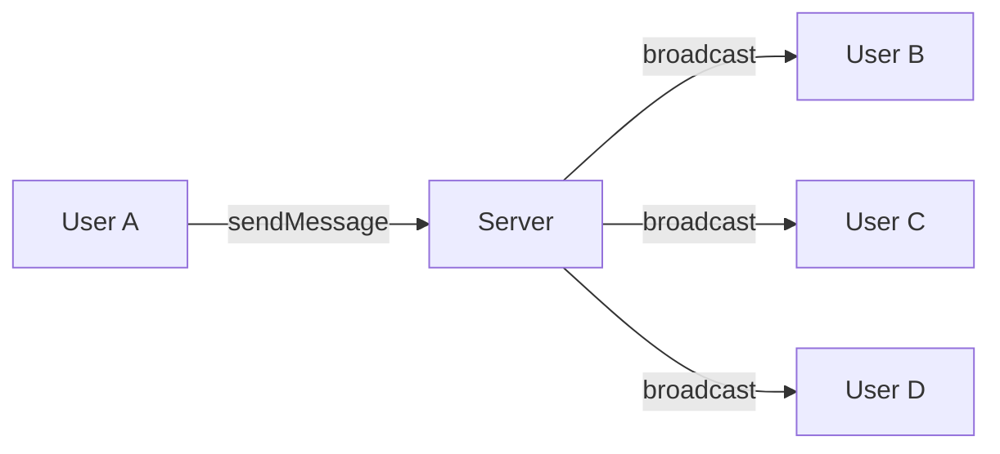
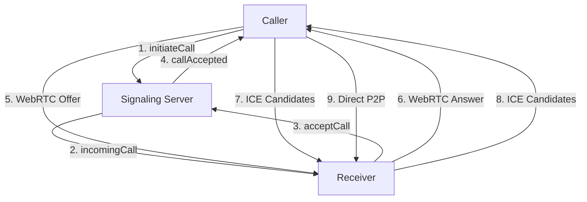
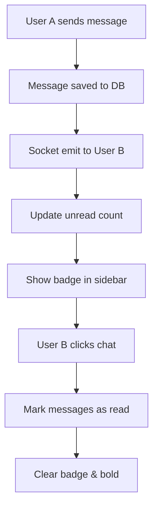

# 🌐 NETWORK PROGRAMMING - HƯỚNG DẪN TOÀN DIỆN

## 📋 **Mục Lục**
1. [Tổng Quan Network Programming](#tổng-quan-network-programming)
2. [Các Giao Thức Mạng](#các-giao-thức-mạng)
3. [Kiến Trúc Client-Server](#kiến-trúc-client-server)
4. [Real-time Communication](#real-time-communication)
5. [WebRTC & Peer-to-Peer](#webrtc--peer-to-peer)
6. [Authentication & Security](#authentication--security)
7. [File Transfer & Media Streaming](#file-transfer--media-streaming)
8. [Message Management & Unread Counts](#message-management--unread-counts)
9. [Error Handling & Resilience](#error-handling--resilience)
10. [Performance & Scalability](#performance--scalability)
11. [Best Practices](#best-practices)

---

## 🎯 **TỔNG QUAN NETWORK PROGRAMMING**

### **Định Nghĩa**
Network Programming là kỹ thuật lập trình để tạo ra các ứng dụng có khả năng giao tiếp qua mạng máy tính, cho phép trao đổi dữ liệu giữa các thiết bị khác nhau.

### **Tại Sao Cần Network Programming?**
- ✅ **Kết nối đa thiết bị**: Chat từ điện thoại, máy tính, tablet
- ✅ **Real-time communication**: Nhắn tin, gọi video tức thì
- ✅ **Data sharing**: Chia sẻ file, hình ảnh, video
- ✅ **Collaboration**: Làm việc nhóm, họp trực tuyến
- ✅ **Global reach**: Kết nối người dùng toàn cầu
- ✅ **Message tracking**: Theo dõi tin nhắn đã đọc/chưa đọc
- ✅ **Smart notifications**: Thông báo thông minh với số lượng tin nhắn

---

## 🔗 **CÁC GIAO THỨC MẠNG**

### **1. HTTP/HTTPS (RESTful APIs)**
```javascript
// Frontend: Gửi request đến backend
const response = await axios.post('/api/auth/login', {
  email: 'user@example.com',
  password: 'password123'
});

// Backend: Xử lý request
app.post('/api/auth/login', async (req, res) => {
  const { email, password } = req.body;
  // Xử lý logic đăng nhập
  res.json({ token: 'jwt_token' });
});
```

**📍 Xuất hiện trong dự án:**
- `frontend/src/lib/axios.js` - Cấu hình HTTP client
- `backend/src/routes/auth.route.js` - API endpoints
- `backend/src/controllers/auth.controller.js` - Xử lý logic

**🎯 Chức năng:**
- Đăng nhập/đăng ký người dùng
- Upload/download file
- Quản lý profile
- CRUD operations cho messages, groups
- Theo dõi tin nhắn chưa đọc
- Quản lý trạng thái đọc tin nhắn

### **2. WebSocket (Socket.io)**
```javascript
// Backend: Socket server
io.on('connection', (socket) => {
  console.log('User connected:', socket.id);
  
  socket.on('sendMessage', (messageData) => {
    // Broadcast message to all users in room
    io.to(`group:${messageData.groupId}`).emit('newMessage', messageData);
  });
});

// Frontend: Socket client
const socket = io('http://localhost:5000', {
  query: { userId: authUser._id }
});

socket.on('newMessage', (message) => {
  // Update UI with new message
  setMessages(prev => [...prev, message]);
});
```

**📍 Xuất hiện trong dự án:**
- `backend/src/lib/socket.js` - Socket.io server setup
- `frontend/src/store/useAuthStore.js` - Socket client connection
- `frontend/src/components/VideoCallModal.jsx` - Real-time signaling

**🎯 Chức năng:**
- Real-time messaging
- Online/offline status
- Video call signaling
- Live notifications
- Real-time unread count updates
- Message read status synchronization

### **3. WebRTC (Peer-to-Peer)**
```javascript
// Tạo peer connection
const peerConnection = new RTCPeerConnection({
  iceServers: [
    { urls: 'stun:stun.l.google.com:19302' },
    { urls: 'turn:openrelay.metered.ca:80' }
  ]
});

// Thêm local stream
localStream.getTracks().forEach(track => {
  peerConnection.addTrack(track, localStream);
});

// Xử lý remote stream
peerConnection.ontrack = (event) => {
  setRemoteStream(event.streams[0]);
};
```

**📍 Xuất hiện trong dự án:**
- `frontend/src/store/useVideoCallStore.js` - WebRTC implementation
- `frontend/src/components/VideoCallModal.jsx` - Video call UI

**🎯 Chức năng:**
- Video/voice calls
- Screen sharing
- Direct peer-to-peer communication
- Low latency media streaming

---

## 🏗️ **KIẾN TRÚC CLIENT-SERVER**

### **Backend Server (Node.js + Express)**
```javascript
// Server setup
const app = express();
const server = http.createServer(app);
const io = new Server(server, {
  cors: { origin: "http://localhost:5173" }
});

// Middleware
app.use(cors());
app.use(express.json());
app.use('/api/auth', authRoutes);
app.use('/api/messages', messageRoutes);

// Socket connection
io.on('connection', (socket) => {
  // Handle real-time events
});
```

**📍 Xuất hiện trong dự án:**
- `backend/src/index.js` - Main server file
- `backend/src/routes/` - API routes
- `backend/src/controllers/` - Business logic
- `backend/src/middleware/` - Authentication middleware

### **Frontend Client (React)**
```javascript
// State management với Zustand
const useAuthStore = create((set, get) => ({
  authUser: null,
  socket: null,
  onlineUsers: [],
  
  login: async (credentials) => {
    const response = await axios.post('/api/auth/login', credentials);
    set({ authUser: response.data.user });
    // Connect socket
    const socket = io('http://localhost:5000', {
      query: { userId: response.data.user._id }
    });
    set({ socket });
  }
}));
```

**📍 Xuất hiện trong dự án:**
- `frontend/src/store/` - State management
- `frontend/src/components/` - UI components
- `frontend/src/pages/` - Page components
- `frontend/src/lib/axios.js` - HTTP client

---

## ⚡ **REAL-TIME COMMUNICATION**

### **Socket Events Flow**


### **Message Broadcasting**
```javascript
// Backend: Broadcast message to group
socket.on('sendMessage', async (messageData) => {
  try {
    // Save to database
    const message = await Message.create(messageData);
    
    // Broadcast to all users in group
    io.to(`group:${messageData.groupId}`).emit('newMessage', {
      ...message.toObject(),
      sender: await User.findById(messageData.senderId)
    });
  } catch (error) {
    socket.emit('error', 'Failed to send message');
  }
});
```

### **Online Status Management**
```javascript
// Track online users
const userSocketMap = {};

io.on('connection', (socket) => {
  const userId = socket.handshake.query.userId;
  userSocketMap[userId] = socket.id;
  
  // Notify all clients about new online user
  socket.broadcast.emit('userOnline', userId);
  
  socket.on('disconnect', () => {
    delete userSocketMap[userId];
    socket.broadcast.emit('userOffline', userId);
  });
});
```

### **Unread Message Counts**
```javascript
// Backend: Track unread messages
const unreadCounts = await Message.aggregate([
  {
    $match: {
      receiverId: userId,
      isRead: false,
      groupId: { $exists: false }
    }
  },
  {
    $group: {
      _id: "$senderId",
      count: { $sum: 1 }
    }
  }
]);

// Emit unread counts update
io.to(socketId).emit('unreadCountsUpdate', unreadMap);
```

### **Message Read Status**
```javascript
// Mark messages as read when user opens chat
await Message.updateMany(
  { senderId: otherUserId, receiverId: currentUserId, isRead: false },
  { isRead: true }
);

// Emit updated unread counts
const updatedCounts = await getUnreadCounts(currentUserId);
io.to(socketId).emit('unreadCountsUpdate', updatedCounts);
```

---

## 🎥 **WEBRTC & PEER-TO-PEER**

### **Video Call Architecture**


### **Signaling Process**
```javascript
// 1. Initiate call
socket.emit('initiateCall', { receiverId, callType: 'video' });

// 2. Handle incoming call
socket.on('incomingCall', (callData) => {
  set({ isIncomingCall: true, incomingCallData: callData });
});

// 3. Accept call
socket.emit('acceptCall', { callId: incomingCallData.callId });

// 4. WebRTC signaling
socket.on('offer', (offer) => {
  await peerConnection.setRemoteDescription(offer);
  const answer = await peerConnection.createAnswer();
  socket.emit('answer', { callId, answer });
});
```

### **ICE Candidate Exchange**
```javascript
// Send ICE candidates
peerConnection.onicecandidate = (event) => {
  if (event.candidate) {
    socket.emit('iceCandidate', {
      callId: currentCall.callId,
      candidate: event.candidate
    });
  }
};

// Receive ICE candidates
socket.on('iceCandidate', (data) => {
  await peerConnection.addIceCandidate(new RTCIceCandidate(data.candidate));
});
```

---

## 🔐 **AUTHENTICATION & SECURITY**

### **JWT Token Authentication**
```javascript
// Backend: Generate JWT
const token = jwt.sign(
  { userId: user._id },
  process.env.JWT_SECRET,
  { expiresIn: '7d' }
);

// Frontend: Include token in requests
axios.defaults.headers.common['Authorization'] = `Bearer ${token}`;

// Backend: Verify token middleware
const authMiddleware = async (req, res, next) => {
  try {
    const token = req.headers.authorization?.split(' ')[1];
    const decoded = jwt.verify(token, process.env.JWT_SECRET);
    req.userId = decoded.userId;
    next();
  } catch (error) {
    res.status(401).json({ error: 'Unauthorized' });
  }
};
```

### **Socket Authentication**
```javascript
// Connect socket with user ID
const socket = io('http://localhost:5000', {
  query: { userId: authUser._id }
});

// Backend: Validate socket connection
io.on('connection', (socket) => {
  const userId = socket.handshake.query.userId;
  if (!userId) {
    socket.disconnect();
    return;
  }
  // Associate socket with user
  userSocketMap[userId] = socket.id;
});
```

---

## 📁 **FILE TRANSFER & MEDIA STREAMING**

### **Image Upload (Cloudinary)**
```javascript
// Frontend: Upload image
const formData = new FormData();
formData.append('image', file);

const response = await axios.post('/api/messages/upload-image', formData, {
  headers: { 'Content-Type': 'multipart/form-data' }
});

// Backend: Process upload
const uploadResult = await cloudinary.uploader.upload(req.file.path);
const message = await Message.create({
  content: uploadResult.secure_url,
  type: 'image',
  senderId: req.userId,
  groupId: req.body.groupId
});
```

### **Media Stream Handling**
```javascript
// Get user media
const stream = await navigator.mediaDevices.getUserMedia({
  video: true,
  audio: true
});

// Add to peer connection
stream.getTracks().forEach(track => {
  peerConnection.addTrack(track, stream);
});

// Handle remote stream
peerConnection.ontrack = (event) => {
  setRemoteStream(event.streams[0]);
};
```

---

## 📬 **MESSAGE MANAGEMENT & UNREAD COUNTS**

### **Unread Message System Architecture**


### **Database Schema Enhancement**
```javascript
// Message model with read status
const messageSchema = new mongoose.Schema({
  senderId: { type: mongoose.Schema.Types.ObjectId, ref: "User", required: true },
  receiverId: { type: mongoose.Schema.Types.ObjectId, ref: "User" },
  groupId: { type: mongoose.Schema.Types.ObjectId, ref: "Group" },
  text: { type: String },
  image: { type: String },
  isRead: { type: Boolean, default: false }, // 👈 New field
}, { timestamps: true });
```

### **Frontend State Management**
```javascript
// useChatStore with unread counts
const useChatStore = create((set, get) => ({
  unreadCounts: {},
  
  getUnreadCounts: async () => {
    const res = await axiosInstance.get("/messages/unread");
    set({ unreadCounts: res.data });
  },
  
  clearUnreadCount: (userId) => {
    const { unreadCounts } = get();
    const newUnreadCounts = { ...unreadCounts };
    delete newUnreadCounts[userId];
    set({ unreadCounts: newUnreadCounts });
  },
  
  setUnreadCounts: (unreadCounts) => {
    set({ unreadCounts });
  }
}));
```

### **Real-time Unread Count Updates**
```javascript
// Socket listener for unread counts
socket.on("unreadCountsUpdate", (unreadCounts) => {
  console.log("📬 Unread counts updated:", unreadCounts);
  useChatStore.getState().setUnreadCounts(unreadCounts);
});

// Backend emit when new message arrives
socket.on("sendMessage", async (messageData) => {
  // Save message
  const message = await Message.create(messageData);
  
  // Emit new message
  io.to(`user:${messageData.receiverId}`).emit("newMessage", message);
  
  // Update unread counts for receiver
  const unreadCounts = await getUnreadCounts(messageData.receiverId);
  io.to(`user:${messageData.receiverId}`).emit("unreadCountsUpdate", unreadCounts);
});
```

### **UI Implementation**
```javascript
// Sidebar component with unread badges
const Sidebar = () => {
  const { unreadCounts, clearUnreadCount } = useChatStore();
  
  return users.map((user) => {
    const unreadCount = unreadCounts[user._id] || 0;
    const hasUnread = unreadCount > 0;
    
    return (
      <button
        onClick={() => {
          setSelectedUser(user);
          if (hasUnread) clearUnreadCount(user._id);
        }}
        className={`${hasUnread ? 'font-bold' : ''}`}
      >
        <span>{user.fullName}</span>
        {hasUnread && (
          <div className="badge badge-primary">
            {unreadCount > 5 ? '5+' : unreadCount}
          </div>
        )}
      </button>
    );
  });
};
```

### **API Endpoints**
```javascript
// GET /api/messages/unread - Get unread counts
export const getUnreadCounts = async (req, res) => {
  const myId = req.user._id;
  
  const unreadCounts = await Message.aggregate([
    {
      $match: {
        receiverId: myId,
        isRead: false,
        groupId: { $exists: false }
      }
    },
    {
      $group: {
        _id: "$senderId",
        count: { $sum: 1 }
      }
    }
  ]);
  
  const unreadMap = {};
  unreadCounts.forEach(item => {
    unreadMap[item._id.toString()] = item.count;
  });
  
  res.status(200).json(unreadMap);
};
```

---

## 🛡️ **ERROR HANDLING & RESILIENCE**

### **Network Error Handling**
```javascript
// Axios interceptors
axios.interceptors.response.use(
  (response) => response,
  (error) => {
    if (error.response?.status === 401) {
      // Redirect to login
      window.location.href = '/login';
    }
    return Promise.reject(error);
  }
);

// Socket error handling
socket.on('connect_error', (error) => {
  console.error('Socket connection failed:', error);
  toast.error('Connection lost. Trying to reconnect...');
});

socket.on('disconnect', (reason) => {
  if (reason === 'io server disconnect') {
    // Reconnect manually
    socket.connect();
  }
});
```

### **Retry Mechanisms**
```javascript
// Retry failed requests
const retryRequest = async (fn, maxRetries = 3) => {
  for (let i = 0; i < maxRetries; i++) {
    try {
      return await fn();
    } catch (error) {
      if (i === maxRetries - 1) throw error;
      await new Promise(resolve => setTimeout(resolve, 1000 * (i + 1)));
    }
  }
};
```

---

## 🚀 **PERFORMANCE & SCALABILITY**

### **Connection Pooling**
```javascript
// Database connection pooling
mongoose.connect(process.env.MONGODB_URI, {
  maxPoolSize: 10,
  serverSelectionTimeoutMS: 5000,
  socketTimeoutMS: 45000,
});
```

### **Message Pagination**
```javascript
// Load messages in chunks
const getMessages = async (groupId, page = 1, limit = 20) => {
  const messages = await Message.find({ groupId })
    .sort({ createdAt: -1 })
    .skip((page - 1) * limit)
    .limit(limit)
    .populate('senderId', 'fullName profilePic');
  
  return messages.reverse();
};
```

### **WebRTC Optimization**
```javascript
// Optimize video quality
const constraints = {
  video: {
    width: { ideal: 1280 },
    height: { ideal: 720 },
    frameRate: { ideal: 30 }
  },
  audio: {
    echoCancellation: true,
    noiseSuppression: true,
    autoGainControl: true
  }
};
```

---

## 📚 **BEST PRACTICES**

### **1. Security Best Practices**
- ✅ Sử dụng HTTPS cho production
- ✅ Validate input data
- ✅ Sanitize user content
- ✅ Rate limiting cho APIs
- ✅ CORS configuration
- ✅ JWT token expiration
- ✅ Message read status validation

### **2. Performance Best Practices**
- ✅ Lazy loading cho components
- ✅ Image compression
- ✅ WebRTC bandwidth adaptation
- ✅ Database indexing
- ✅ Caching strategies
- ✅ Efficient unread count aggregation
- ✅ Real-time state synchronization

### **3. Error Handling Best Practices**
- ✅ Graceful degradation
- ✅ User-friendly error messages
- ✅ Logging và monitoring
- ✅ Retry mechanisms
- ✅ Fallback options
- ✅ Socket reconnection handling
- ✅ Unread count recovery

### **4. Code Organization Best Practices**
- ✅ Separation of concerns
- ✅ Modular architecture
- ✅ Consistent naming conventions
- ✅ Documentation
- ✅ Testing

---

## 🎯 **TÓM TẮT**

### **Network Programming trong Chat Ting Ting:**

1. **HTTP/HTTPS**: RESTful APIs cho authentication, CRUD operations
2. **WebSocket**: Real-time messaging, online status, notifications
3. **WebRTC**: Video/voice calls, screen sharing, peer-to-peer communication
4. **File Transfer**: Image upload via Cloudinary
5. **Message Management**: Unread counts, read status tracking
6. **Security**: JWT authentication, input validation, CORS

### **Lợi ích đạt được:**
- ✅ Real-time communication
- ✅ Low latency video calls
- ✅ Scalable architecture
- ✅ Secure data transmission
- ✅ Cross-platform compatibility
- ✅ Smart message tracking
- ✅ Enhanced user experience

### **Công nghệ sử dụng:**
- **Backend**: Node.js, Express, Socket.io, MongoDB
- **Frontend**: React, Axios, WebRTC API, Zustand
- **Infrastructure**: Cloudinary, JWT, CORS
- **Real-time**: Socket.io, WebRTC, MongoDB Aggregation

---

## 📖 **TÀI LIỆU THAM KHẢO**

- [WebRTC Documentation](https://webrtc.org/)
- [Socket.io Guide](https://socket.io/docs/)
- [Express.js Documentation](https://expressjs.com/)
- [React Documentation](https://reactjs.org/)
- [MongoDB Documentation](https://docs.mongodb.com/)

---

*Tài liệu này được tạo để hỗ trợ hiểu biết về Network Programming trong dự án Chat Ting Ting.*
